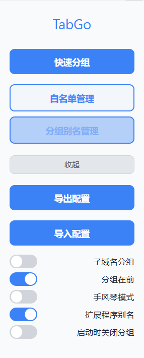

# TabGo

一个功能强大的 Chrome/Edge 浏览器标签页自动分组扩展，专为垂直标签页用户设计。

## 📖 项目简介

使用 Edge 浏览器时，习惯于垂直标签页布局，一直想找一个自动分组的扩展。找到的扩展不能完全满足需求，索性自己写了一个功能更全面的版本。

## ✨ 核心功能

### 自动分组
- **智能域名分组**：根据网站域名自动将标签页分组
- **子域名匹配**：支持完整子域名匹配或仅匹配主域名
- **IP 地址支持**：识别并按 IP 地址分组标签页
- **多窗口支持**：独立处理多个浏览器窗口的标签分组

### 自定义管理
- **白名单功能**：排除特定域名，不进行自动分组
- **自定义分组名称**：为域名设置自定义分组名（一对多映射）
  - 一个分组名可以包含多个域名
  - 支持折叠/展开查看分组成员
  - 支持删除单个域名或整个分组
- **分组位置控制**：可选将分组标签页置于未分组标签页之前
- **手风琴模式**：激活某个分组时自动折叠其他分组

### 扩展功能
- **右键菜单集成**：
  - 添加当前域名到白名单
  - 为当前域名设置分组名称
  - 快速触发分组操作
- **配置导入/导出**：将白名单和分组名称导出为 JSON 文件，支持跨设备同步
- **扩展程序别名**：将扩展 ID 替换为可读的扩展名称
- **Chrome 特殊页面映射**：为 Chrome/Edge 内置页面显示友好名称
- **启动行为控制**：可选在浏览器启动时关闭所有分组标签页

### 智能处理
- **TLD 自动处理**：自动移除常见顶级域名后缀，使分组名称更简洁
- **URL 自动解析**：输入完整 URL 时自动提取域名或 IP
- **域名验证**：验证输入的域名和 IP 地址格式是否正确

## 🛠️ 技术栈

| 组件 | 技术 |
|------|------|
| **扩展标准** | Manifest V3 |
| **运行时** | Chrome Service Worker |
| **存储** | Chrome Storage API (sync + local) |
| **前端** | 原生 HTML/CSS/JavaScript (ES6+) |
| **样式** | CSS3 + CSS Variables |
| **API** | Chrome Tabs, Tab Groups, Context Menus, Storage, Management, Runtime |

## 📦 安装方法

### 从源码安装

1. 克隆或下载本项目
```bash
git clone https://github.com/yourusername/tabGo.git
```

2. 打开 Chrome/Edge 浏览器，进入扩展管理页面
   - Chrome: `chrome://extensions/`
   - Edge: `edge://extensions/`

3. 开启"开发者模式"

4. 点击"加载已解压的扩展程序"

5. 选择项目文件夹

## 📚 使用指南

### 快速开始

1. **安装扩展后**，标签页会自动按域名分组
2. **点击扩展图标**，打开弹出窗口进行配置
3. **右键点击页面**，使用快捷菜单添加白名单或设置分组名称

### 白名单管理

1. 点击扩展图标 → "白名单管理"
2. 输入域名或完整 URL（自动提取域名）
3. 点击"添加"按钮
4. 白名单中的域名不会被自动分组

### 分组别名管理

1. 点击扩展图标 → "分组别名管理"
2. 输入分组名称和域名（支持多个域名对应一个分组）
3. 点击"添加成员"
4. 点击分组名称可展开/折叠查看成员
5. 点击 ✕ 图标可删除单个域名或整个分组

### 配置导入/导出

1. 点击扩展图标 → "更多" → "导出配置"
   - 下载包含白名单和分组名称的 JSON 文件
2. 点击"导入配置"
   - 选择之前导出的 JSON 文件
   - 导入的数据会与现有数据合并（不会覆盖）

### 设置选项

| 选项 | 说明 |
|------|------|
| **子域名分组** | 开启：按完整子域名分组<br>关闭：仅按主域名分组 |
| **分组在前** | 开启：分组标签页显示在未分组标签页之前 |
| **手风琴模式** | 开启：激活某个分组时自动折叠其他分组 |
| **扩展程序别名** | 开启：显示扩展名称而非扩展 ID |
| **启动时关闭分组** | 开启：浏览器启动时关闭所有分组标签页 |

## 📁 项目结构

```
tabGo/
├── manifest.json          # 扩展配置文件
├── background.js          # 后台服务脚本（核心逻辑）
├── popup.html/js          # 弹出窗口界面
├── options.html/js        # 白名单管理页面
├── groupName.html/js      # 分组别名管理页面
├── content_script.js      # 内容脚本
├── domain.txt             # 常见顶级域名列表
├── aliases.json           # Chrome 特殊页面别名映射
└── icons/                 # 扩展图标
```

## 🔧 开发说明

### 数据存储结构

**Chrome Sync Storage:**
```javascript
{
  "whitelist": ["example.com", "test.com"],
  "groupNames": {
    "工作": ["github.com", "gitlab.com"],
    "社交": ["twitter.com", "facebook.com"]
  }
}
```

**Chrome Local Storage:**
```javascript
{
  "subdomainEnabled": false,
  "groupTop": true,
  "accordion": false,
  "extensionReplace": true,
  "clearGroupedTabs": false,
  "extensionReplaceMap": { "extension-id": "Extension Name" }
}
```

### 分组算法

1. 提取标签页 URL 的域名或 IP
2. 检查是否在白名单中（跳过分组）
3. 查找是否有自定义分组名称
4. 处理扩展页面（映射扩展 ID 到名称）
5. 移除常见 TLD 后缀
6. 创建或更新标签组
7. 可选：重新排序标签页（分组在前）

## 📸 截图



## 🤝 贡献

欢迎提交 Issue 和 Pull Request！

## 📄 许可证

MIT License

## 🙏 致谢

感谢所有为这个项目提供建议和反馈的用户。
